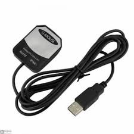
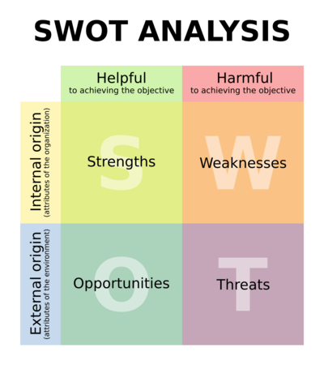

# Network_Security_Project
This project is developed for the UNICA.IT University Network Security exam. 


> **Master's degree in Computer Engineering, Cybersecurity and Artificial Intelligence - University of Cagliari**

> **Network Security - Supervisor: Prof. Marco Martalò**

> **Authors**: Lello Molinario: 70/90/00369 - Federico Moro: 70/90/00380


***
# Table of Contents
1. [Installation](#installation)
2. [Project Goal](#project-goal)
4. [Solution Design](#solution-design)
5. [Hardware Design](#hardware-design)
6. [Conclusions](#conclusions)


***
## Installation

- Download the ZIP code or clone the repository inside Raspberry PI 3 B+ with
  ```bash
  git clone https://github.com/lmolinario/Network_Security_Project.git
  ```
- Install the requirements with

  ```bash
  pip3 install -r requirements.txt
  ```
- Install the requirements GPS service daemon with 

  ```bash
  apt-get install gpsd
  ```
  
- Run the file `entrypoint.py` to start the program (in UNIX-like System)
or
- Run the file `rsb_UK.py` to start the program (optimezed version file for Raspberry Pi)

If you are italian:
- Esegui il file `rsb_IT.py` per avviare il programma (versione ottimizzata per Raspberry Pi)

## Project goal
The objectives we have set ourselves to achieve with this project are:
- analysis of the hardware necessary for the development of the project;
- use and development of Python code that uses GPS modules;
- use and development of Python code that uses wifi modules;
- use and development of Python code that uses system call modules to hack, crack and find vulnerabilities in a digital system;
- use and development of Python code for exporting data into acquired files;
- analysis of the results achieved.

## Solution Design
The operation of Wi-PY is very simple: it detects all Wi-Fi devices present nearby and tries to capture useful packets to search for the network authentication password. This process generates a file containing the data useful for discovering the password of the network under attack.

If a WEP network is detected for an access point, we start collecting initialization vectors (IVs). To collect enough IVs to decrypt the WEP key, you can simply listen to the network traffic and save it, or use a technique called injection to speed up the process. Injection causes the access point (AP) to resend the selected packets over and over again very quickly. This allows us to capture a large number of IVs in a short period of time.
Once we have acquired a large number of IVs, we can use them to determine the WEP key.

If a WPA network is detected for an access point, the goal is to capture the authentication handshake and decrypt the pre-shared key.
This can be done actively or passively. “Active” means you will speed up the deauthentication process of an existing wireless client. “Passive” simply means waiting for a wireless client to authenticate to the WPA network

Whenever a key is found, the process will be stopped and the result will be displayed.

## Hardware Design
The hardware we used was the following:

- Raspberry PI 3 B+
  <p align="center">
  
</p>


- USB-GPS-module-Navigation-Positioning-G-mouse – U-Blox
  <p align="center">
  
</p>


- Network 1000 mW Long-Range USB Wi-Fi Adapter, AWUS036NEH
  <p align="center">
  
</p>

- Assembled system
  <p align="center">
  
</p>


## Conclusions

In order to analyze the data obtained and make them accessible to the most, I decided to use a methodology used to make strategic choices starting from the map of factors (both internal and external, positive or negative) that can influence the choice itself.


This methodology is called “SWOT” analysis (Strengths, Weaknesses, Opportunities and Threats).

The SWOT is made up of a 2×2 matrix in which the factors that have a potential, positive or negative impact on what is being analyzed or wanted to be achieved are appropriately identified and organised.
  <p align="center">
  
</p>

